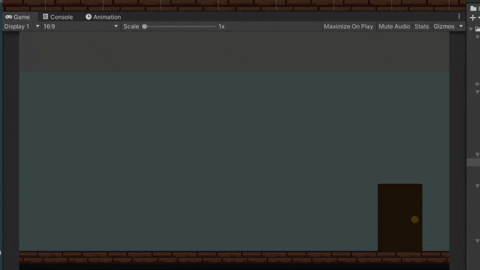
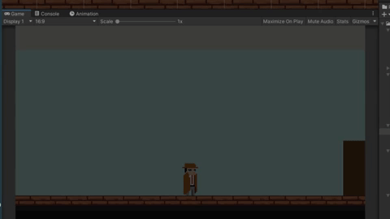
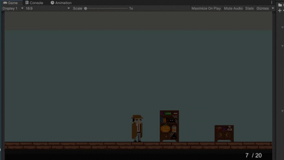

# spookyjam

2D Horror project

main features:
  - Exploration (besides the typical 2D, add different layers of rooms to give it a sense of depth)
  - Flashlight mechanics
  - Shooting mechanics (not main focus, should be very limited and scarce bullets, only as last resort)
  - Aiming should point towards current cursor position and move accordingly
  - Basic Inventory system
  - Dialogue system (read notes, interact with objects)
  - Some puzzles
   
   
<h2>Walk and load new scene</h2>

New scene on load needs transition effect

<h2>Flashlight version 1</h2>

Future versions of the light mechanics will allow the player to control the flashlight direction, it will point to where the cursor is.

<h2>Aim and Shoot version 1</h2>

This version of the shooting and aiming is more proof of concept, future versions will allow the user to control the direction
of the gun and light, it will point to where the cursor is.

<h2>Reload System</h2>

Works for any magazine size, easy to implement additional weapons, or weapon magazine upgrade

